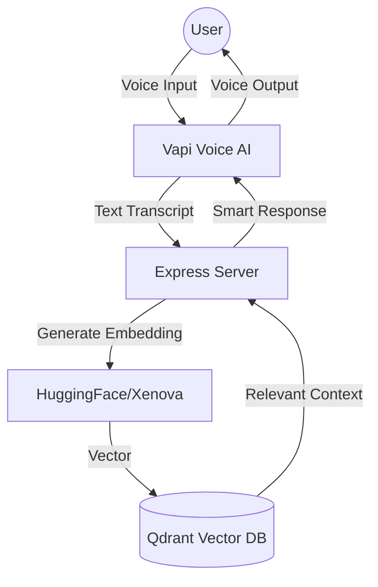

# 🌾 Rural Financial Agent: Empowering the Unbanked through Voice AI

> **Bridging the digital divide for rural communities through intuitive, multilingual Voice-First AI.**

[](https://github.com/your-repo)
[](https://qdrant.tech/)
[](https://vapi.ai/)

---

## 🛑 The Problem
Over **1.7 billion people** globally remain unbanked, often due to literacy barriers, language gaps, and the overwhelming complexity of digital financial tools. In rural areas, the "digital-first" world often feels like a "digital-only" barrier.

## ✨ Our Solution
The **Rural Financial Agent** is an inclusive, voice-driven AI companion designed for users who find traditional apps intimidating or inaccessible. By combining **Natural Language Processing**, **Real-time Voice Synthesis**, and **Semantic Search**, we've built a bridge that allows anyone to navigate financial systems simply by speaking.

---

## 🚀 Key Features

- **🗣️ Voice-First Navigation**: No typing, no complex UI. Just talk to the agent like a friend.
- **🧠 Context-Aware Intelligence**: Powered by **Qdrant**, the agent remembers previous interactions and retrieves hyper-relevant financial advice.
- **🌍 Multilingual & Dialect-Ready**: Built to support low-literacy and diverse language groups, ensuring no one is left behind.
- **⚡ Local Embedding Processing**: Uses `@xenova/transformers` to process data securely and efficiently with `all-MiniLM-L6-v2`.
- **🏦 Financial Literacy & Support**: Simplifies complex banking terms, interest calculations, and government scheme registrations.

---

## 🏗️ Technical Architecture



1.  **Voice Processing**: [Vapi](https://vapi.ai/) handles ultra-low latency STT (Speech-to-Text) and TTS (Text-to-Speech).
2.  **Semantic Search**: [Qdrant](https://qdrant.tech/) stores and retrieves financial knowledge based on semantic meaning rather than just keywords.
3.  **Local Inference**: We utilize **Xenova Transformers** to run embeddings locally, reducing latency and reliance on external API calls for feature extraction.

---

## 🛠️ Installation & Setup

### 📦 Prerequisites
- **Node.js** (v18+)
- **Qdrant Cloud** API Key
- **Vapi** Account

### 🔧 Configuration
1. Clone the repo: `git clone https://github.com/your-username/Rural-Financial-Agent.git`
2. Install dependencies: `npm install` inside the `voice-ai-backend` folder.
3. Create a `.env` file:
```env
PORT=5000
QDRANT_URL=your_qdrant_cloud_endpoint
QDRANT_API_KEY=your_api_key
HF_API_KEY=your_optional_hf_key
```

### 🏃 Running the project
```bash
npm start
```

---

## 🛣️ Roadmap
- [ ] **Offline Mode**: Local caching for areas with poor connectivity.
- [ ] **WhatsApp Integration**: Bringing the voice agent to the world's most used messaging platform.
- [ ] **Live Transaction Support**: Secure voice-authorized micro-payments.
- [ ] **Support for 10+ Local Dialects**: Fine-tuning models for rural linguistic nuances.

## 🤝 Social Impact
This project isn't just about technology; it's about **Financial Inclusion**. By removing the requirement of literacy and digital fluency, we enable farmers, small-scale vendors, and rural families to take control of their financial futures.

---

### 🛡️ License
Distributed under the ISC License. See `LICENSE` for more information.

---
*Built with ❤️ for the accessibility-first hackathon.*
